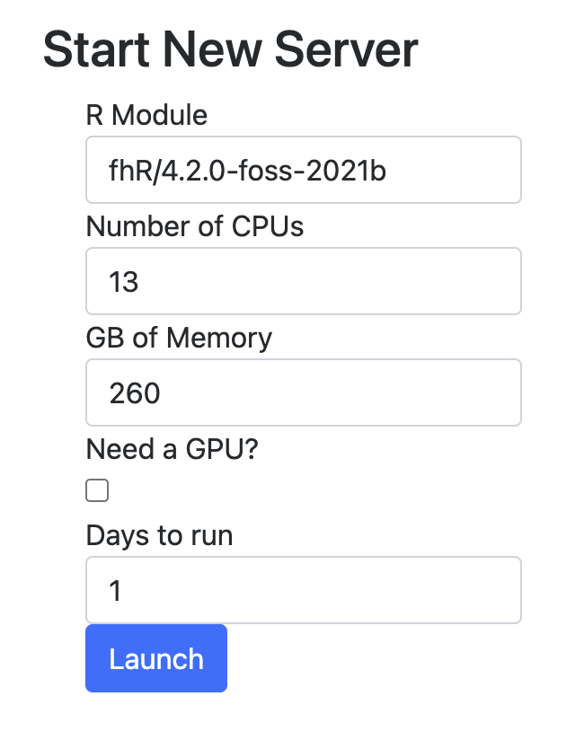

# Excellent bioinformatics tutorials:

[Setting up your local computer](http://sfurlan.com/wp/)

[Intro to single cell RNA and ATAC](https://bookdown.org/ytliu13207/SingleCellMultiOmicsDataAnalysis/monocle2.html#load-seurat-obj)

[Gene set enrichment](https://crazyhottommy.github.io/scRNA-seq-workshop-Fall-2019/scRNAseq_workshop_3.html)

[Heatmap basics](https://jokergoo.github.io/ComplexHeatmap-reference/book/index.html)

[sc Heatmap](https://divingintogeneticsandgenomics.rbind.io/post/enhancement-of-scrnaseq-heatmap-using-complexheatmap/)

[Enhanced seurat plotting](https://samuel-marsh.github.io/scCustomize/)

[TCR analysis](https://www.bioconductor.org/packages/release/bioc/vignettes/scRepertoire/inst/doc/vignette.html)

# Getting set up on the cluster

1. Get permission to rhino from SciComp

2. Run the following lines in terminal

```
ssh fred_hutch_username@rhino

ml fhR/4.2.0-foss-2021b

R
```

3. Then copy and paste <a href="SetUp/SetUP.R">this file</a> into terminal

4. Then go to [here](https://rstudio-launcher.fredhutch.org/)

Make it look like this...

<p align="left"></a></p>
<hr>

5. Refresh page and click on your gizmo link :)

<p align="left"></a></p>
<hr>
